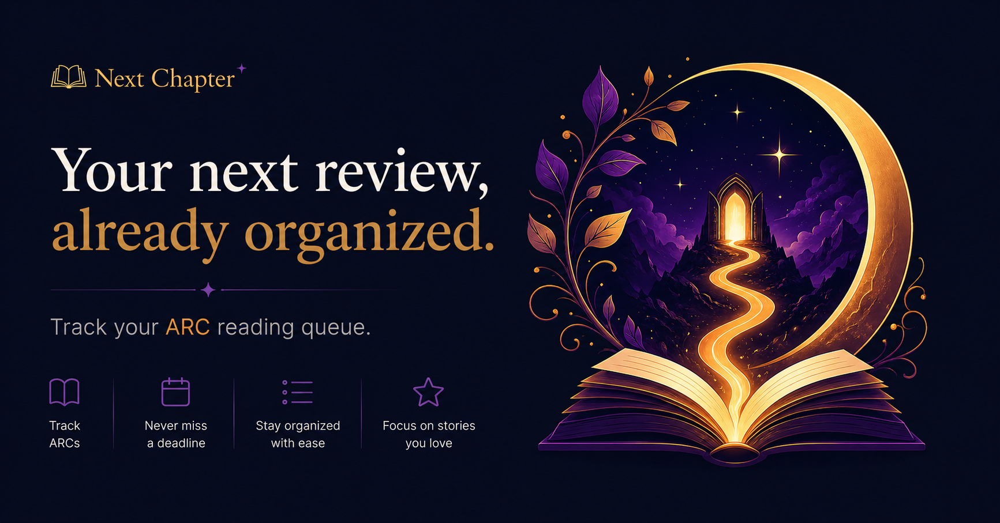

# Next Chapter 📚✨

  

  A beautifully simple ARC management app for book reviewers.

  Track ARCs • Manage deadlines • Stay ahead of reviews

---
## Overview

Next Chapter helps reviewers keep track of Advance Reader Copies (ARCs), reading progress, review deadlines, and upcoming releases without relying on spreadsheets or scattered notes.

Built as a mobile-first Progressive Web App (PWA), it provides a focused workspace for managing your reading queue and ensuring no review deadline slips through the cracks.

  

---

## Features

### 📖 ARC Library

Manage all your ARCs in one place:

- Book title and author
- Cover image support
- Release date tracking
- Review deadlines
- Date received
- Reading progress
- Personal notes
- Ratings and review links

Missing cover art? No problem. Next Chapter automatically displays a clean placeholder design.

---

### 🗂 Reading Workflow

Track every book through your review journey:

- To Read
- Currently Reading
- Finished
- DNF (Did Not Finish)

Review status tracking:

- Not Started
- Drafted
- Submitted
- Published

---

### 📊 Dashboard

Get an instant overview of your workload:

- Total Active ARCs
- Currently Reading
- Reviews Pending
- Overdue Books

Quickly identify:

- Books due this week
- Books due this month
- Overdue reviews

---

### ⚡ Smart Prioritization

Every book displays:

- Review deadline
- Days remaining
- Reading status
- Review status

Urgency indicators help you focus on what needs attention first.

| Status   | Indicator |
|----------|-----------|
| Overdue  | 🔴 Red     |
| Due Soon | 🟠 Orange  |
| On Track | 🟢 Green   |

---

### 🎯 Kanban Workflow

Visualize your reading pipeline with a drag-and-drop board:

To Read → Reading → Finished → Reviewed

Move books between stages effortlessly and keep your workflow organized.

---

### 🔍 Search & Filtering

Find books instantly.

Filter by:

- Reading Status
- Review Status

Sort by:

- Nearest Deadline
- Furthest Deadline
- Release Date
- Recently Added

---

### 📱 Progressive Web App

Install Next Chapter directly to your phone or desktop.

Benefits:

- Native-app feel
- Fast loading
- Responsive design
- Works beautifully on mobile devices

No app store required.

---

## Why Next Chapter?

Most ARC tracking systems eventually become complicated spreadsheets.

Next Chapter focuses on the essentials:

- What am I reading?
- What is due next?
- Which reviews are pending?
- What has already been completed?

Nothing more. Nothing less.

---

Future Ideas

Potential future enhancements:

- Email-based ARC import
- Goodreads integration
- StoryGraph integration
- Reading analytics
- Calendar view
- Publisher tracking

These features are intentionally excluded from the initial release to keep the experience focused and lightweight.

---

Inspiration

Every ARC represents the beginning of a new story.

Next Chapter exists to help reviewers spend less time managing spreadsheets and more time discovering worlds worth talking about.

> Track your ARCs. Meet your deadlines. Turn the page to your next chapter.
